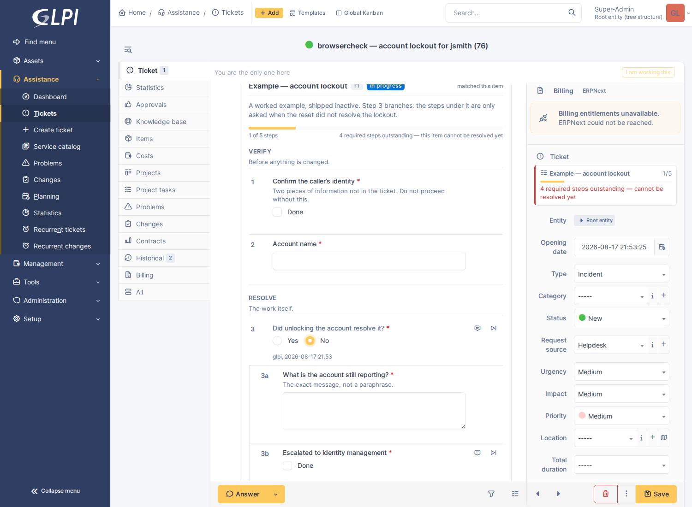
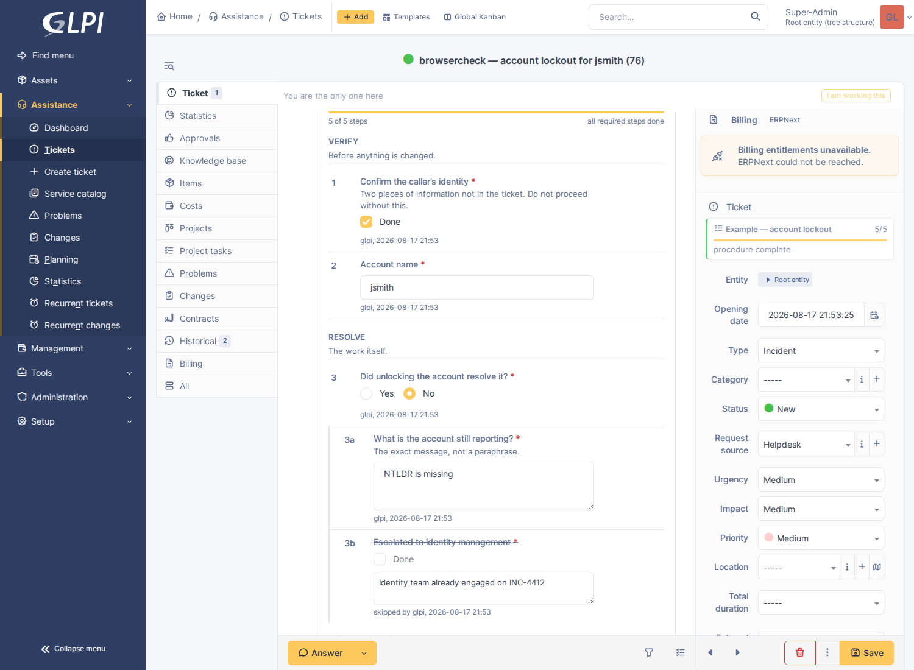
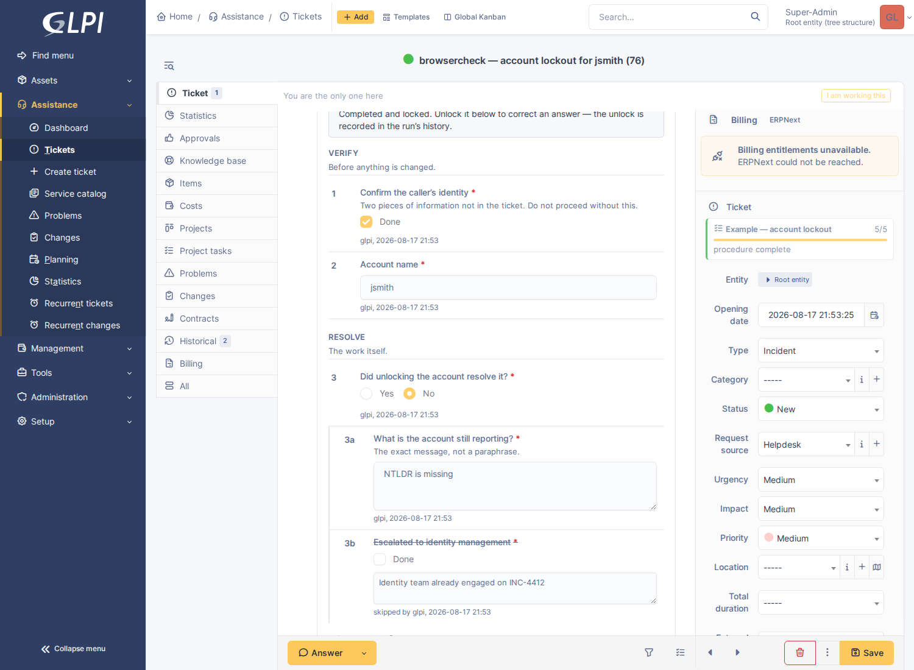
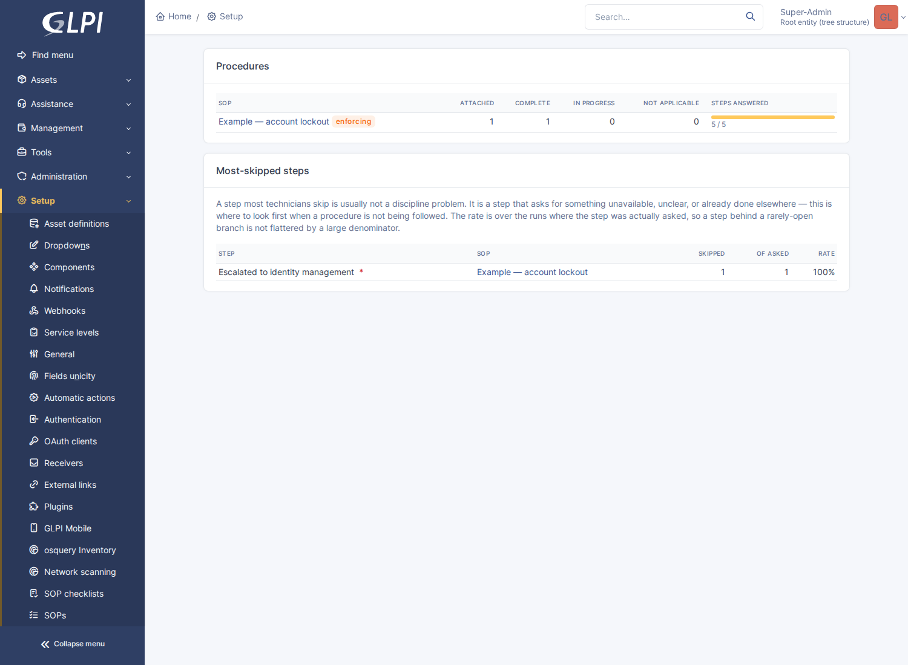
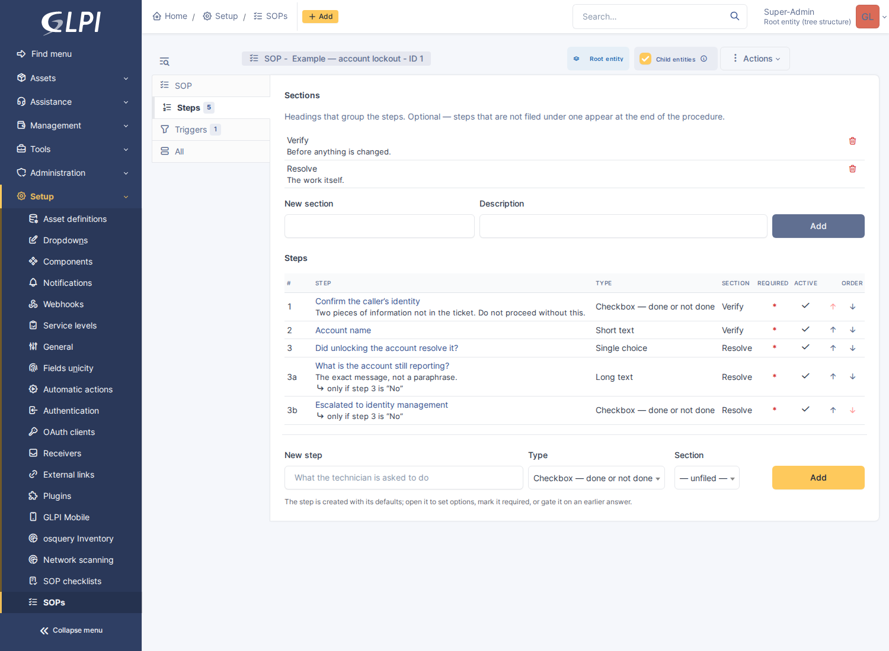
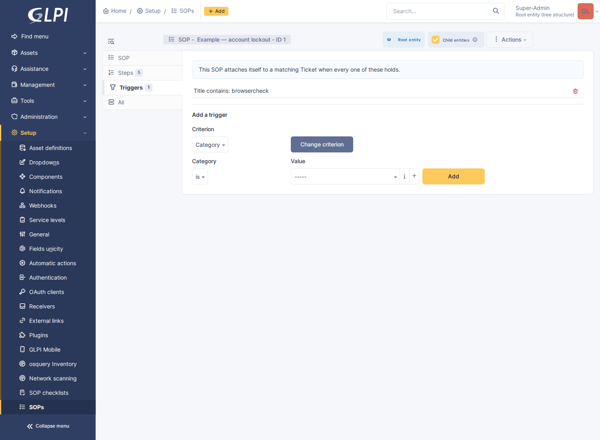

# GLPI SOP

Interactive, admin-authored standard operating procedures on GLPI tickets,
changes and problems.

An administrator writes a procedure once. It puts itself on the tickets it
applies to, asks the technician the questions that are actually relevant, and
records what was answered — by whom, when — on the ticket itself.

## What makes it more than a checklist field

**Steps are typed.** A step can be a checkbox, but it can also ask for a
number, a date, one of a fixed set of answers, a user, an asset, or a file. The
answers are stored as data, so "was the serial recorded" is a query rather than
a reading exercise over free text.

**It is not somewhere a technician has to go and look.** The checklist *is* a
timeline entry, sitting in the ticket's own record alongside the followups it
explains — not behind a tab, which is where procedures go to be ignored. A
standing one-line reminder in the fields panel says what is still outstanding
and links straight to it, so a long ticket cannot scroll it out of mind.

**Steps are conditional.** A step is gated on a list of conditions joined by
*all of them* or *any one* — an earlier answer in this run, a field of the
ticket itself, or the state of the ticket's own approvals — and — this is the
part that matters — **a step that is not being asked is not outstanding**. It
does not count towards completion and it cannot hold the ticket open.



Answer *Yes* at step 3 and 3a/3b are never asked: the run is complete at 3 of 3
and the ticket can be closed. Answer *No*, as above, and they appear in place —
no reload — the run reopens, and it cannot. Without that rule a branching
procedure's completion count is a lie.

Every answer saves itself as it is given, with who gave it and when. A step can
be skipped with a recorded reason rather than silently left undone:



A finished run locks itself, so what it records stops being quietly editable.
Unlocking is one click and goes into the run's history:



**Procedures find the ticket, not the other way round.** Nobody has to remember
that a lockout ticket has a procedure.

## What it does

- **Authoring** — sections and steps, fourteen step types, per-step guidance,
  required flags, and a gate of one or more conditions. Steps and headings both
  reorder with arrows over the list you are looking at. Every structural edit
  bumps the SOP's revision, and each run records the revision it started
  against.
- **Conditions**, from three places, combined with all/any:
  - an **earlier answer** in this run — was answered, is, is not, is greater
    than, is less than;
  - a **field of the item** — the same criteria the triggers offer, so a step
    can depend on what the request arrived as rather than on what somebody
    ticked;
  - an **approval on the item** — its approval status, or whether a named
    person or a member of a named group granted one. This is what lets "the
    manager approved the hire" be the real approval record instead of a
    checkbox a technician can tick on their behalf.
- **Approval as a step, not a checkbox** — an `approval` step has no control to
  tick. It is satisfied when the item's own approval reaches the state the step
  requires (approved, waiting, or refused), optionally by a named person or a
  member of a named group, and it goes back to outstanding if that approval is
  later withdrawn or refused. An enforcing SOP holds the ticket open until the
  approval is really there.
- **Work that belongs to somebody else**, as a step: a `ticket` step raises a
  linked ticket (title and description templated, category and assignee group
  preset, linked as a child), and either counts itself done at that point or
  waits until that ticket is solved. An enforcing SOP therefore holds the
  parent open until the licence has actually been bought, not until somebody
  remembered to ask for it.
- **Attachment**, three additive ways:
  - the SOP's own **triggers** (category, type, urgency, impact, priority,
    request source, location, entity, requester/assignee group, title or
    description — matched with is / is-not / is-under / contains / regex);
  - a binding on the **ITIL template** the item was raised from;
  - an **"Attach an SOP" action in GLPI's own business rules**, for people who
    already express their triage there.
- **Running** — the checklist is a timeline entry on the item, and saves itself
  as it is filled in. Close the browser halfway through and nothing is lost.
  Steps can be skipped with a recorded reason, annotated with a note, or
  cleared.
- **Enforcement** — optionally, per SOP, an outstanding required step refuses
  both doors to resolution: the status change *and* filing a solution. While
  that is true the *Solution* action and the Solved/Closed statuses are greyed
  out with the reason on hover, so nobody writes a solution only to have it
  refused. The refusal is server-side and stands on its own; greying out the
  controls is a courtesy on top of it.
- **Locking** — a run locks itself the moment it completes, so a finished
  procedure is a record rather than a still-editable draft. Anyone who could
  answer it can unlock it again from the checklist; the unlock and the re-lock
  are both written to the run's history.
- **The record** — an append-only history records every answer, change, skip,
  unlock and completion. A run can additionally transcribe itself into a
  followup when it completes (off by default — see the settings note).
- **A first draft, written from tickets you already fixed** — where glpi-ai is
  installed, a procedure can be drafted from the resolved tickets in one
  category: what people wrote on them, the tasks, and the checks any procedure
  already recorded. It arrives switched off, attached to nothing, and with a
  note of which tickets it came from. See below.
- **Adoption reporting** — runs and completion per SOP, and a **most-skipped
  steps** table. A step most technicians skip is usually not a discipline
  problem: it asks for something unavailable, unclear, or already done
  elsewhere. That table is where to look first when a procedure is not being
  followed.

  

Technician (central) interface only. Requesters never see a procedure or its
answers.

## Install

```bash
# from the GLPI root
git clone https://github.com/bijstaan/glpi-sop.git plugins/glpisop
php bin/console plugin:install -u glpi glpisop
php bin/console plugin:activate glpisop
```

Requires GLPI 11.0 or later.

Installing seeds one example procedure — *Example — account lockout* — which
ships **inactive and non-attaching**, so nothing appears on anybody's tickets
until you publish it. It exists because the conditional step is hard to
describe and obvious to look at.

## Using it

**Author** at *Setup → SOPs* — or at *Service management → SOPs* where **GLPI
Nav** is installed, which files procedures beside known errors and improvements
rather than under Setup. Create the SOP, then work through its tabs:

| Tab | What goes there |
|---|---|
| *SOP* | name, which itemtypes it applies to, whether it attaches itself, whether it blocks resolution |
| *Steps* | sections and steps; open a step to set its type options, mark it required, or gate it on an earlier answer |
| *Triggers* | the criteria under which it attaches itself, joined with AND or OR |

The builder shows the shape of the procedure at a glance — the numbering makes
the branch visible, and each gate is written out against it rather than as an
id:



Triggers read as sentences, and the panel says up front whether they are
actually being evaluated:



Bind an SOP to a ticket template from the template's own **SOPs** tab
(*Setup → Templates*). Attach one from a business rule by adding the
**Attach an SOP** action to a `RuleTicket` / `RuleChange` / `RuleProblem`.

**Run** it from the ticket itself. The checklist appears in the timeline as soon
as the procedure attaches; the reminder above the *Status* field — which is
exactly where someone reaches to close a ticket — shows the progress, warns when
resolution is blocked, and jumps to the checklist when clicked.

## Drafting a procedure from tickets

*Setup → SOPs → Draft from tickets.* Needs
[glpi-ai](../glpi-ai) installed, configured with a provider, and this entity
permitted by its tenant gate.

Pick a category and a window; the page lists the tickets that were resolved in
it and says what is written on each one. Untick the ones that are not really
the same problem — one outlier is enough to put a step in the procedure that
does not belong there — and press the button. What comes back is a real SOP,
switched off, with its steps, its headings, and a category trigger already on
it.

**The category is the cluster.** The roadmap this came from asked for
procedures drafted from *clusters* of resolved tickets, which sounds like it
needs similarity search. It does not, and the category is the better key
anyway: an SOP attaches on category, so a procedure drafted from the last dozen
tickets in one is a procedure whose trigger is the same thing that chose its
evidence. What a distance metric cannot notice is that a category is a dumping
ground — so that judgement is asked of the model, which can answer "these are
not one procedure" and is told to.

**It arrives inactive, and that is the measurement.** A drafted procedure is a
proposal. Somebody switching it on is the accept, and the same page reports
what became of the earlier ones: how many were switched on, how many were
deleted, and how many of the proposed steps are still there. "Nine of twelve
steps kept" says something about draft quality that an accept rate cannot.

What it will not do:

- **Invent a step type nobody implements.** The list of types the model is
  offered is also the allowlist its answer is checked against; anything else is
  dropped and reported, rather than failing the whole draft.
- **Propose workflow.** `ticket` and `approval` steps are answered by somebody
  other than the technician, and a model reading ticket prose cannot see the
  organisational facts those depend on.
- **Draft from nothing.** A ticket carrying only a title contributes nothing
  and is unticked for you; below the configured minimum of usable tickets the
  button refuses. What comes back from four thin tickets is one ticket
  generalised, which reads exactly like a procedure and is not one.
- **Publish.** Inactive, `is_autoattach` off, and the trigger inert until both
  are turned on.

The tickets are sent to whichever provider glpi-ai is configured with, so this
is a decision about client data before it is a decision about a feature —
hence its own switch on the settings page, on top of glpi-ai's per-entity gate.

## What the assistant can do with procedures

Where [glpi-ai](../glpi-ai) is installed, this plugin registers six tools with
it, so HEIMDALL — and anything else driving the model — can read and write
procedures on the technician's behalf.

**Reading**, always available:

| Tool | Answers |
|---|---|
| `sop_progress` | What the checklist on this ticket says: done, skipped, outstanding, and what is blocking a solve |
| `sop_library` | Which procedures exist for this kind of work, their steps, and what would make each attach itself |

**Writing**, which needs write tools enabled in glpi-ai *and* the
`plugin_glpisop_sop` right at create or update level:

| Tool | Does |
|---|---|
| `sop_create` | Writes a new procedure from what the technician dictates |
| `sop_add_steps` | Appends steps to a procedure that already exists, under an existing heading or a new one |
| `sop_update_step` | Rewords a step, changes whether it is required, or retires it |
| `sop_update` | Renames a procedure, rewrites its description, changes which itemtypes it applies to |

"Write this up as a procedure" after a nasty ticket is the moment procedures
actually get written, and it is exactly the moment nobody has twenty minutes
for the step form.

Three rules hold across all four writers, and they are the ones that make this
safe to leave switched on:

- **Nothing is activated.** A created procedure is inactive and attaches to
  nothing, and no tool can change either flag — not even to switch one off.
  Activation is the decision that turns a document into something that can hold
  a queue's tickets open, and it stays with a person. It is also the only
  accept signal a drafted procedure has.
- **Nothing is deleted.** A step can be *retired*, which keeps it and every
  answer ever recorded against it and is one click to reverse. There is no tool
  that removes a step, a heading or a procedure.
- **A step type nobody implements is dropped, and said so.** The list of types
  the model is offered is the same list its answer is checked against — one
  definition, in `StepWriter`, shared with the drafting prompt. Two of the
  plugin's types are deliberately never offered: `ticket` and `approval` are
  answered by somebody other than the technician, and a model reading ticket
  prose cannot see the organisational facts those depend on.

The four writers are **not** declared on every request. Past glpi-ai's
tool-search threshold only pinned tools are handed to the model up front, and
these are the ones worth leaving out: they carry this plugin's largest schemas
and are wanted on the rare turn where somebody is writing a procedure. The two
readers stay pinned, so the model always knows the site has procedures — which
is what makes it search for how to write one. `find_tools` ranks `sop_create`
first for "write this up as a procedure", and `sop_add_steps` first for "add a
step to the procedure".

Permissions are checked twice on purpose. glpi-ai refuses the tool before the
handler runs if the signed-in user lacks the right; each handler then re-loads
the procedure and calls `can(UPDATE)` itself, which is what applies the entity
restriction — an id is an integer a model can arrive at by counting, and the
right alone says nothing about whose procedure it names.

## Settings

*Setup → Plugins → GLPI SOP*, or *Setup → SOP checklists*.

| Setting | Default | Notes |
|---|---|---|
| Itemtypes | Ticket, Change, Problem | Where SOPs may be attached at all |
| Evaluate SOP triggers | yes | Master switch for trigger matching |
| Re-evaluate when an item changes | yes | Triage is where the category is still wrong — this is where most real attachments happen |
| Let SOPs block resolution | yes | Gates the per-SOP flag; one switch to undo a misconfigured procedure |
| Let technicians skip a step | yes | A skip is recorded as an explicit "not done", never as an answer |
| Require a reason to skip | yes | The reason lands on the record and in the completion followup |
| Lock a run as soon as it completes | yes | Unlocking is one click, and logged |
| Freeze a completed run after | 0 days | Age-based, and unlike the lock it has no key. 0 disables it |
| Also transcribe the run into a followup | **no** | See below |
| That followup is internal | yes | SOP answers are written for colleagues |
| Allow procedures to be drafted from resolved tickets | yes | Inert without glpi-ai; sends ticket content to its provider |
| Look back | 180 days | Long enough to reach a recurrence, short enough to describe how the work is done now |
| Read at most | 12 tickets | Past a dozen the shared shape stops getting clearer while the prompt keeps growing |
| Refuse below | 4 tickets | Below this there is no pattern to find |

Note that *Let SOPs block resolution* only enables the per-SOP
`enforce_on_solve` flag, which itself ships off — no procedure blocks anything
until someone decides it should.

The completion followup is **off by default**, which is a deliberate change of
mind: the checklist is a timeline entry now, so a followup repeating it does not
make the procedure any more visible — it duplicates it. What a followup still
buys is durability, which is a narrower want: it is plain ticket data, so it
survives this plugin being disabled or removed, and it reaches notification
emails and printed exports, which a plugin-rendered timeline entry does not.
Turn it on if you need the answers to outlive the plugin.

## Rights

| Right | Grants |
|---|---|
| `plugin_glpisop_sop` | Authoring procedures, triggers and bindings |
| `plugin_glpisop_run` | Answering a checklist on an item |

Granted on install to profiles that can already update `config` and `ticket`
respectively. Answering additionally requires update access to the item itself,
so the run right does not let anyone edit a procedure on a ticket they cannot
otherwise touch.

## The technician app

A procedure is a list of things somebody does *while doing them*, and a good
share of that work happens in a comms cabinet rather than at a desk. Answered
afterwards, from memory, is the failure mode this plugin exists to remove — so
the checklist is reachable from glpi-mobile over the high-level API.

| Method | Path | Purpose |
| --- | --- | --- |
| `GET` | `/GlpiSop/item/{itemtype}/{items_id}/runs` | the procedures attached to a ticket, with their counters |
| `GET` | `/GlpiSop/runs/{id}` | one run: sections, steps, answers, visibility, progress |
| `POST` | `/GlpiSop/runs/{id}/steps/{steps_id}/answer` | answer a step (`value`, or `value_itemtype`+`value_items_id`, or `documents_id`) |
| `POST` | `/GlpiSop/runs/{id}/steps/{steps_id}/clear` | un-answer it |
| `POST` | `/GlpiSop/runs/{id}/steps/{steps_id}/skip` | skip it with a reason (again to un-skip) |
| `POST` | `/GlpiSop/runs/{id}/steps/{steps_id}/note` | write or erase its note |
| `POST` | `/GlpiSop/runs/{id}/steps/{steps_id}/spawn` | raise the ticket a ticket-step asks for |
| `GET` | `/GlpiSop/runs/{id}/log` | the run's history |

Three properties are worth stating, because they are what makes the app's
checklist the same checklist rather than a second implementation of one:

- **Every write answers with the whole run, recomputed.** One answer can open a
  branch, close another, complete the run and unblock the ticket. None of that
  is derivable on a client, so none of it is attempted there.
- **Validation stays here.** `StepType::normalize()` decides whether an answer
  is acceptable and its refusals come back as `422` with the message it wrote
  ("Must be at least 4", "Pick one of the offered options"). A step marked done
  is a compliance claim; the client cannot be the thing that decides one is
  valid.
- **The step is checked against the run's own SOP, and the item is re-derived
  from the run.** A run id arrives from a client, so without both this would
  report — and let anyone edit — the procedure on any ticket in the instance
  from a guessed id.

Steps whose answer lives elsewhere (`approval`, and the pickers a phone does not
have) are sent with their state and rendered read-only rather than hidden: a
step nobody can see is a step nobody does. Document steps are answerable by
`documents_id`, which pairs with glpi-mobile's own upload endpoint.

Feature discovery goes through glpi-mobile's `glpimobile_capabilities` hook:
`runs` (READ on `plugin_glpisop_run`) and `answer` (UPDATE). They are separate
because a read-only technician has a real use for the first.

## Design notes

The interesting decisions and the traps found while building this are in
[docs/spec.md](https://gitlab.rfni.dev/norsewind/glpi-erpnext-mods/-/wikis/glpi-sop/spec) — in particular why visibility is computed only on
the server, why the unique key on `runs` is load-bearing rather than defensive,
and the GLPI 11 CSRF behaviour that makes `X-Requested-With` mandatory on a
`fetch()`.

## Tests

`glpi-sop/tests/browser/sop-check.js` drives the checklist in a real browser: that a
control saves itself on change, that a text field saves on a pause rather than
per keystroke, that a branch opens and closes in place without a reload, that
skipping demands a reason first, and that the completion followup reaches the
timeline. It also renders the authoring tabs and the adoption page, and fails
on any JavaScript error.

```bash
cd glpi-sop/tests/browser
eval "$(./sop-setup.sh)"                       # publishes the example SOP, raises a matching ticket
TICKET_ID=$TICKET_ID SHOT_DIR=. node sop-check.js
```

The screenshots above are its output, so they cannot drift from what the plugin
actually renders.

## Licence

GNU General Public License, version 3 or later — the same licence as GLPI.
This plugin is loaded into GLPI's process and extends its classes, so it is a
derivative work of GLPI and carries GLPI's licence. See [LICENSE](LICENSE).
