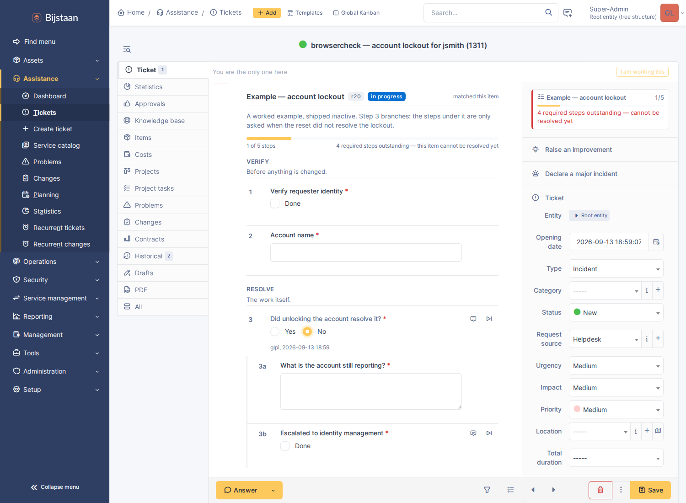
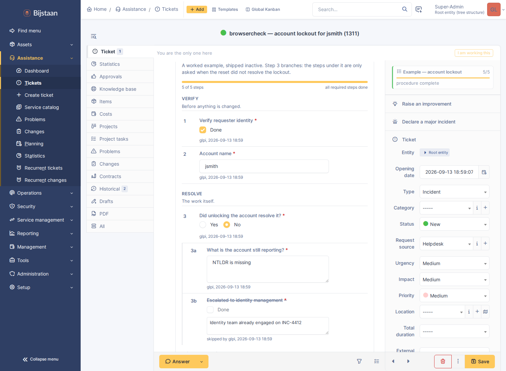
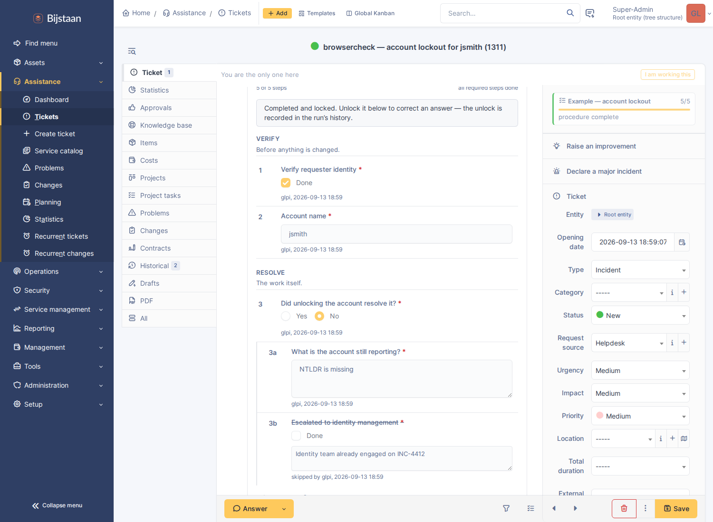
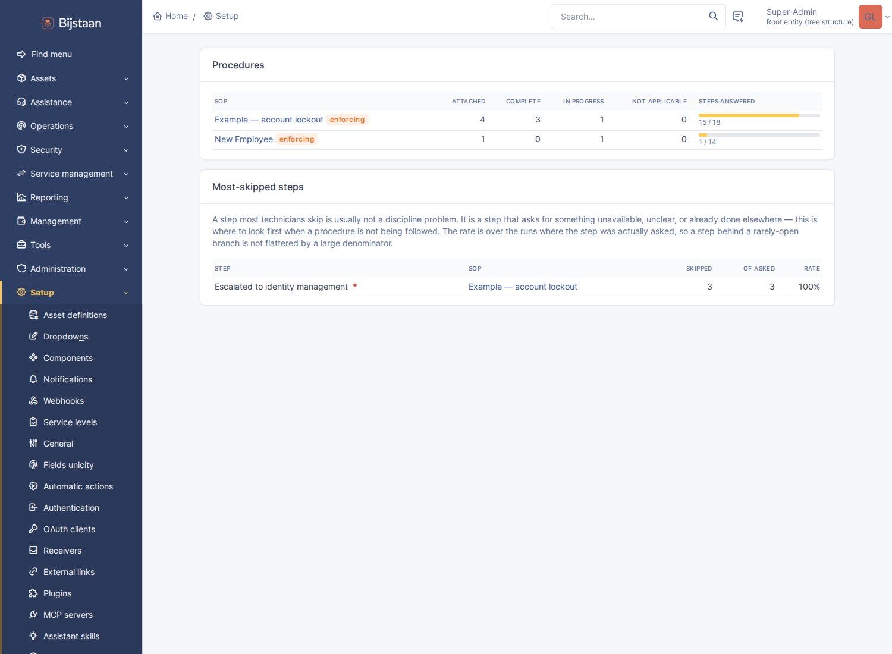
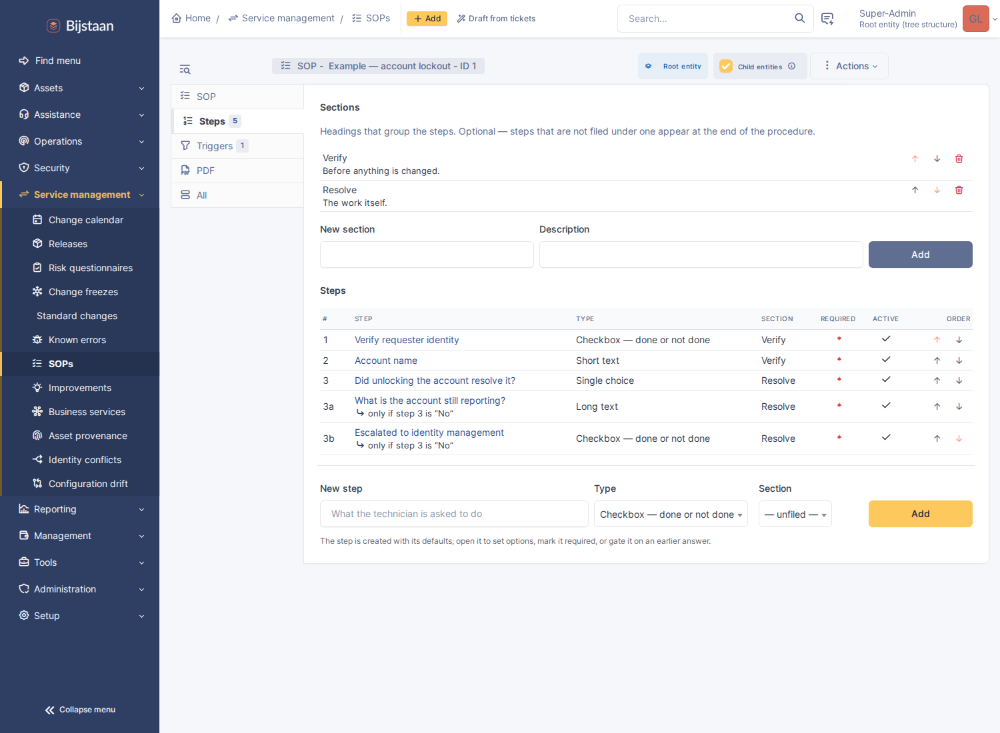
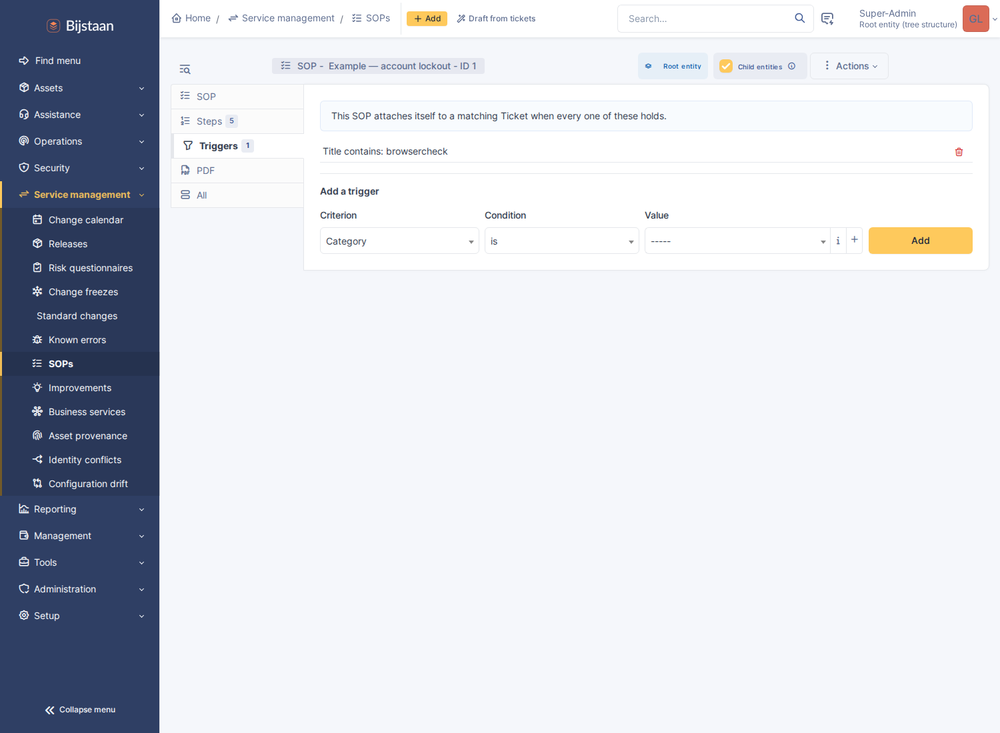

# GLPI SOP

Interactive, admin-authored standard operating procedures on GLPI 11 tickets,
changes and problems.

An administrator writes a procedure once. It attaches itself to the tickets it
applies to, asks the technician the questions that are relevant, and records what
was answered — by whom, when — on the ticket itself.



## What makes it more than a checklist field

- **Steps are typed.** Fourteen types: checkbox, number, date, a fixed set of
  answers, a user, an asset, a file, and more. Answers are stored as data, so
  "was the serial recorded" is a query rather than a reading exercise.
- **The checklist is a timeline entry**, in the ticket's own record beside the
  followups it explains, not behind a tab. A standing one-line reminder in the
  fields panel says what is outstanding and links to it.
- **Steps are conditional**, gated on a list of conditions joined by all-of or
  any-of. **A step that is not being asked is not outstanding**: it does not
  count towards completion and cannot hold the ticket open. Without that rule a
  branching procedure's completion count is a lie.
- **Procedures find the ticket**, not the other way round.

Answer *Yes* at step 3 and 3a/3b are never asked: the run is complete at 3 of 3.
Answer *No* and they appear in place with no reload, and the run reopens.





## Features

- **Authoring** — sections and steps, per-step guidance, required flags, and a
  gate of one or more conditions. Steps and headings reorder with arrows. Every
  structural edit bumps the SOP's revision, and each run records the revision it
  started against.
- **Conditions** from three places, combined with all/any:
  - an **earlier answer** in this run — was answered, is, is not, is greater
    than, is less than;
  - a **field of the item** — the same criteria the triggers offer;
  - an **approval on the item** — its status, or whether a named person or a
    member of a named group granted one.
- **Approval as a step**, with no control to tick. Satisfied when the item's own
  approval reaches the required state (approved, waiting, refused), optionally by
  a named person or group member, and back to outstanding if that approval is
  withdrawn or refused.
- **Work that belongs to somebody else**, as a step: a `ticket` step raises a
  linked child ticket with title and description templated and category and
  assignee group preset, and either counts itself done at that point or waits
  until that ticket is solved.
- **Attachment**, three additive ways: the SOP's own triggers (category, type,
  urgency, impact, priority, request source, location, entity, requester or
  assignee group, title, description — matched with is / is-not / is-under /
  contains / regex); a binding on the ITIL template; or an **Attach an SOP**
  action in GLPI's own business rules.
- **Running** — saves itself as it is filled in, so closing the browser halfway
  loses nothing. Steps can be skipped with a recorded reason, annotated, or
  cleared.
- **Enforcement**, optional per SOP: an outstanding required step refuses both
  doors to resolution, the status change and filing a solution. The *Solution*
  action and the Solved/Closed statuses grey out with the reason on hover. The
  refusal is server-side and stands on its own; greying out is a courtesy.
- **Locking** — a run locks itself on completion. Unlocking is one click, and
  both the unlock and re-lock go into the run's history.
- **An append-only history** of every answer, change, skip, unlock and
  completion. A run can additionally transcribe itself into a followup.
- **Adoption reporting** — runs and completion per SOP, plus a most-skipped
  steps table. A step most technicians skip usually asks for something
  unavailable, unclear, or already done elsewhere.

  

Technician (central) interface only. Requesters never see a procedure or its
answers.

## Install

```bash
# from the GLPI root
git clone https://github.com/bijstaan/glpi-sop.git plugins/glpisop
php bin/console plugin:install -u glpi glpisop
php bin/console plugin:activate glpisop
```

Installing seeds one example procedure, *Example — account lockout*, **inactive
and non-attaching**, so nothing appears on anybody's tickets until you publish
it.

## Using it

**Author** at *Setup → SOPs*, or *Service management → SOPs* where `glpinav` is
installed.

| Tab | What goes there |
|---|---|
| *SOP* | name, which itemtypes it applies to, whether it attaches itself, whether it blocks resolution |
| *Steps* | sections and steps; open a step for its type options, required flag, or gate |
| *Triggers* | the criteria under which it attaches itself, joined with AND or OR |





Bind an SOP to a ticket template from the template's own **SOPs** tab (*Setup →
Templates*). Attach one from a business rule by adding the **Attach an SOP**
action to a `RuleTicket` / `RuleChange` / `RuleProblem`.

**Run** it from the ticket. The checklist appears in the timeline as soon as the
procedure attaches; the reminder above the *Status* field shows progress, warns
when resolution is blocked, and jumps to the checklist when clicked.

## Drafting a procedure from tickets

*Setup → SOPs → Draft from tickets.* Needs `glpiai` installed, configured with a
provider, and this entity permitted by its tenant gate.

Pick a category and a window; the page lists the tickets resolved in it and what
is written on each. Untick the ones that are not really the same problem, and
press the button. What comes back is a real SOP, switched off, with steps,
headings and a category trigger already on it.

**The category is the cluster.** An SOP attaches on category, so a procedure
drafted from the last dozen tickets in one has a trigger that is the same thing
that chose its evidence. A category can also be a dumping ground, so that
judgement is asked of the model, which can answer "these are not one procedure".

**It arrives inactive, and that is the measurement.** Somebody switching it on is
the accept, and the same page reports what became of the earlier ones: how many
were switched on, how many deleted, and how many proposed steps survive. "Nine of
twelve steps kept" says something an accept rate cannot.

It will not:

- **Invent a step type nobody implements.** The list offered to the model is the
  allowlist its answer is checked against; anything else is dropped and reported
  rather than failing the whole draft.
- **Propose workflow.** `ticket` and `approval` steps are answered by somebody
  other than the technician.
- **Draft from nothing.** A ticket carrying only a title contributes nothing and
  is unticked for you; below the configured minimum the button refuses.
- **Publish.** Inactive, `is_autoattach` off, trigger inert until both are on.

The tickets are sent to whichever provider glpiai is configured with, so this has
its own switch on the settings page on top of glpiai's per-entity gate.

## glpi-ai tools

Reading, always available:

| Tool | Answers |
|---|---|
| `sop_progress` | What the checklist on this ticket says: done, skipped, outstanding, and what blocks a solve |
| `sop_library` | Which procedures exist for this kind of work, their steps, and what would make each attach |

Writing, needing write tools enabled in glpiai *and* `plugin_glpisop_sop` at
create or update:

| Tool | Does |
|---|---|
| `sop_create` | Writes a new procedure from what the technician dictates |
| `sop_add_steps` | Appends steps under an existing heading or a new one |
| `sop_update_step` | Rewords a step, changes whether it is required, or retires it |
| `sop_update` | Renames a procedure, rewrites its description, changes its itemtypes |

Three rules hold across all four writers:

- **Nothing is activated.** A created procedure is inactive and attaches to
  nothing, and no tool can change either flag. Activation is what turns a
  document into something that can hold a queue's tickets open, and it is also
  the only accept signal a drafted procedure has.
- **Nothing is deleted.** A step can be *retired*, keeping it and every answer
  recorded against it, reversible in one click.
- **A step type nobody implements is dropped and said so.** One definition in
  `StepWriter`, shared with the drafting prompt. `ticket` and `approval` are
  never offered.

The four writers are not declared on every request: past glpiai's tool-search
threshold only pinned tools go to the model up front, and these carry this
plugin's largest schemas for a rare turn. The two readers stay pinned, so the
model always knows the site has procedures. `find_tools` ranks `sop_create`
first for "write this up as a procedure".

Permissions are checked twice: glpiai refuses the tool before the handler runs if
the user lacks the right, and each handler re-loads the procedure and calls
`can(UPDATE)`, which is what applies the entity restriction.

## Settings

*Setup → Plugins → GLPI SOP*, or *Setup → SOP checklists*.

| Setting | Default | Notes |
|---|---|---|
| Itemtypes | Ticket, Change, Problem | Where SOPs may be attached at all |
| Evaluate SOP triggers | yes | Master switch for trigger matching |
| Re-evaluate when an item changes | yes | Triage is where the category is still wrong, and where most real attachments happen |
| Let SOPs block resolution | yes | Gates the per-SOP flag; one switch to undo a misconfigured procedure |
| Let technicians skip a step | yes | A skip is recorded as an explicit "not done", never as an answer |
| Require a reason to skip | yes | The reason lands on the record and in the completion followup |
| Lock a run as soon as it completes | yes | Unlocking is one click, and logged |
| Freeze a completed run after | 0 days | Age-based, and unlike the lock it has no key. 0 disables it |
| Also transcribe the run into a followup | **no** | See below |
| That followup is internal | yes | SOP answers are written for colleagues |
| Allow procedures to be drafted from resolved tickets | yes | Inert without glpiai; sends ticket content to its provider |
| Look back | 180 days | |
| Read at most | 12 tickets | Past a dozen the shared shape stops getting clearer while the prompt grows |
| Refuse below | 4 tickets | Below this there is no pattern to find |

*Let SOPs block resolution* only enables the per-SOP `enforce_on_solve` flag,
which itself ships off.

The completion followup is off by default: the checklist is a timeline entry, so
a followup repeating it duplicates rather than reveals. What it still buys is
durability — plain ticket data that survives this plugin being removed and
reaches notification emails and printed exports.

## Rights

| Right | Grants |
|---|---|
| `plugin_glpisop_sop` | Authoring procedures, triggers and bindings |
| `plugin_glpisop_run` | Answering a checklist on an item |

Granted at install to profiles that can already update `config` and `ticket`
respectively. Answering additionally requires update access to the item itself.

## API

The checklist is reachable from `glpimobile` over the high-level API, because a
good share of this work happens in a comms cabinet rather than at a desk.

| Method | Path | Purpose |
| --- | --- | --- |
| `GET` | `/GlpiSop/item/{itemtype}/{items_id}/runs` | the procedures attached to a ticket, with counters |
| `GET` | `/GlpiSop/runs/{id}` | one run: sections, steps, answers, visibility, progress |
| `POST` | `/GlpiSop/runs/{id}/steps/{steps_id}/answer` | answer a step |
| `POST` | `/GlpiSop/runs/{id}/steps/{steps_id}/clear` | un-answer it |
| `POST` | `/GlpiSop/runs/{id}/steps/{steps_id}/skip` | skip it with a reason (again to un-skip) |
| `POST` | `/GlpiSop/runs/{id}/steps/{steps_id}/note` | write or erase its note |
| `POST` | `/GlpiSop/runs/{id}/steps/{steps_id}/spawn` | raise the ticket a ticket-step asks for |
| `GET` | `/GlpiSop/runs/{id}/log` | the run's history |

- **Every write answers with the whole run, recomputed.** One answer can open a
  branch, close another, complete the run and unblock the ticket; none of that is
  derivable on a client.
- **Validation stays server-side.** `StepType::normalize()` decides whether an
  answer is acceptable, and its refusals come back as `422` with the message it
  wrote. A step marked done is a compliance claim.
- **The step is checked against the run's own SOP, and the item re-derived from
  the run.** A run id arrives from a client; without both this would let anyone
  edit the procedure on any ticket from a guessed id.

Steps whose answer lives elsewhere (`approval`, and pickers a phone does not
have) are sent with their state and rendered read-only rather than hidden.
Document steps are answerable by `documents_id`, pairing with glpimobile's upload
endpoint.

Feature discovery goes through `glpimobile_capabilities`: `runs` (READ on
`plugin_glpisop_run`) and `answer` (UPDATE), separate because a read-only
technician has a use for the first.

## Tests

```bash
cd tests/browser
eval "$(./sop-setup.sh)"                       # publishes the example SOP, raises a matching ticket
TICKET_ID=$TICKET_ID SHOT_DIR=. node sop-check.js
```

Drives the checklist in a real browser: a control saving itself on change, a text
field saving on a pause rather than per keystroke, a branch opening and closing
in place without a reload, skipping demanding a reason first, and the completion
followup reaching the timeline. It renders the authoring tabs and the adoption
page, fails on any JavaScript error, and produces the screenshots above.

Three things to know before reading the code: visibility is computed only on the
server, the unique key on `runs` is load-bearing rather than defensive, and GLPI
11's CSRF behaviour makes `X-Requested-With` mandatory on a `fetch()`.

## Licence

GPL-3.0-or-later, the same licence as GLPI. The plugin is loaded into GLPI's
process and extends its classes, so it is a derivative work. See
[LICENSE](LICENSE).
